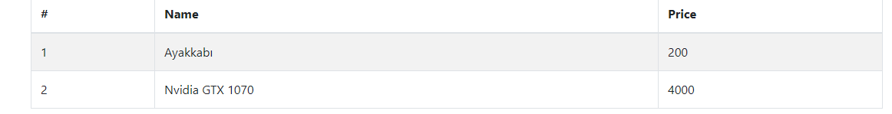
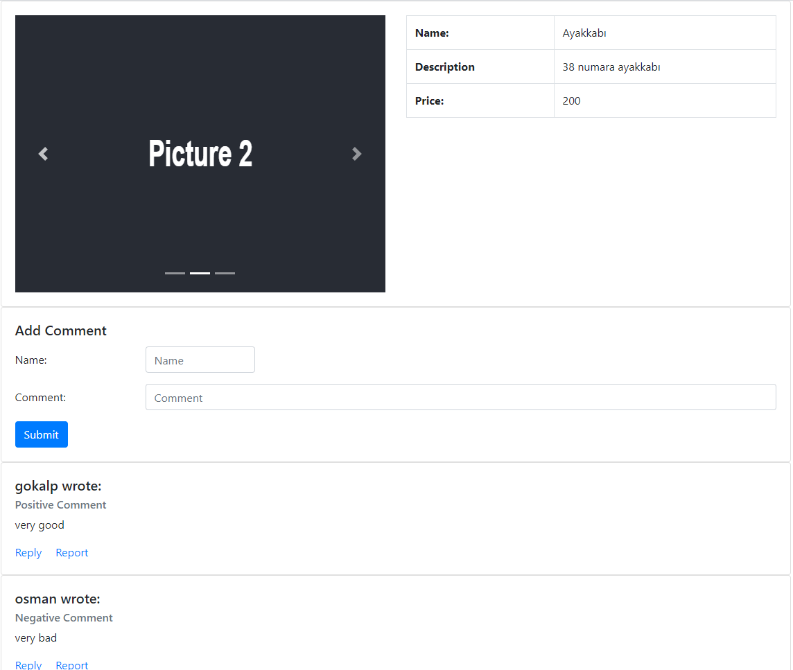

# sentiment_analysis

## Gereksinimler

### React
- react-bootstrap
- axios
- react-router-dom
- holderjs

### Python
- Anaconda >2
- flask_cors
- flask
- joblib

### Java Spring Boot
- Java >10

## Kurulum 
- E_market_api dizininde backend tarafı Main sınıfı ile çalıştırılır.
- Client dizininde react projesi “npm start” komutu ile çalıştırılır.
- Sentiment_analyzer dizininde python web engine Main.py çalıştırılır.

### Sentiment Analisys
- Dataset Olarak Amazon Fine Food Reviews https://www.kaggle.com/snap/amazon-fine-food-reviews?select=Reviews.csv kullanılmıştır.
- İçindeki veriler 3 ün üstünde ve altında puan alan yorumları olarak pozitif ve negatif olarak sınıflandırılmıştır.
- Summary kolonundaki girdilerin etiketi 1 veya -1 olan sentiment olarak alınır.
- Kelimeleri algoritmaya sokabilmek için CountVectorizer kullanılır.
- Böylece train_set olan kelimelerin sayısının bulunduğu bir matrise dönüştürülür.
- train test spliti yapılıp 2 sınıf sınıflandırılması için Logistic Regression modeline fit edilir.
- Çıkan test sonucunda accuracy 0.93 olduğu için ekstra geliştirme uygulanmamıştır.
- Çıkan model kaydedilir ve gelen string'i analiz edecek bir method için kullanılır.

## Çalışma Prensibi
- Veriler İlişkilendirilmiş veritabanında tutulur.
- Product ve Comment arasında OneToMany ilişkisi bulunur.
- EMarketController Rest Controller’ı olarak çalışır, verileri veritabanından çeker ve gelen yorumları veritabanına kaydeder.
- Gelen yorumun duygu analizinin tekrarlanmaması için, atanan duyguyu; pozitif: True, negatif: False olarak tutar.
- React kısmında Kullanıcı ürün listesini görebilir, bir ürün seçip detaylarına ulaşabilir.
- Yorum yapmak istediğinde yorum ekleme kısmına ismini ve yorumunu girerek yorumunu ekleyebilir.
- Eklenen yorumlar python tarafına bir istek şeklinde iletilir.
- Python tarafında gelen yorumun duygu analizi yapılır ve pozitif, negatif olarak karar kılınır.
- Yorum etiketlendikten sonra Python tarafı Spring boot tarafında istekte bulunur.
- Spring boot tarafı yorumu kaydeder.

